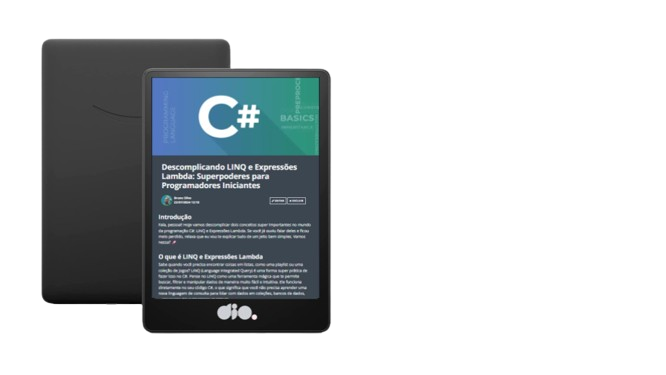

    

  

-------

  

# Projeto artigo técnico gerado por I.A.s

Projeto com o objetivo de gerar um artigo técnico com um layout rico, leitura agradável e com foco em promover sua autoridade técnica.

<a href="https://web.dio.me/articles/descomplicando-linq-e-expressoes-lambda-superpoderes-para-programadores-iniciantes?back=%2Farticles&open-modal=true&page=1&order=oldest" title="View PDF now"> 📕Clique aqui para ler o artigo</a>

## 💻 Tecnologias utilizadas no projeto

- [ChatGPT](https://chat.openai.com/) - para título e conteúdo

## ✨ Features

- Conteúdo gerado via ChatGPT

## 📚 Materiais

- prompts utilizados

Comporte-se como um escritor de artigos tech backend e escreva um artigo atendendo as regras abaixo:

{REGRAS}
No máximo 5 linhas por blocos de explicação.
Me explique de maneira informal, como se eu fosse um adolescente de 15 anos.
Os blocos que serão criados estão abaixo:
- O que é LINQ e Expressões Lambda.
- Cite exemplos com códigos de LINQ e Expressões Lambda.
- Faça um call to action para minhas redes sociais.
- Coloque 3 hashtags que façam sentido.